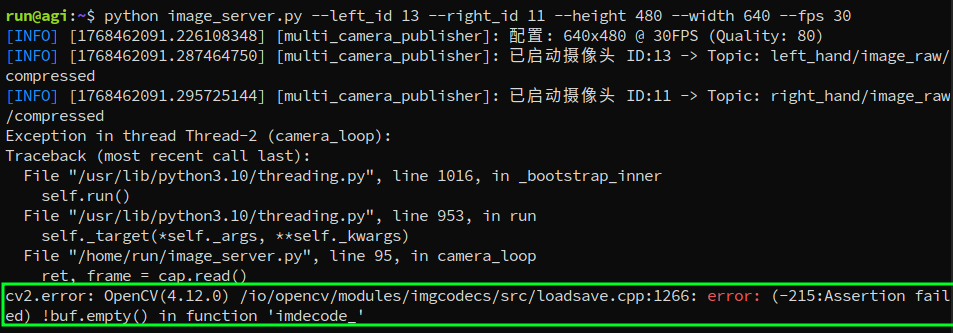
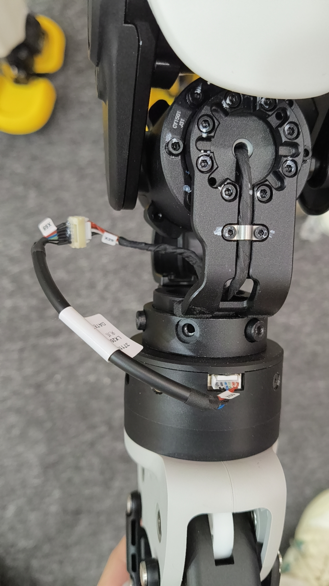

# X2 Teleopration
这个仓库是海信基于[XRoboToolkit-Teleop-Sample-Python](https://github.com/XR-Robotics/XRoboToolkit-Teleop-Sample-Python)开发的，使用PICO VR遥操作智元X2机器人。

目前实现的功能有：
1. 使用手柄遥操作双臂和夹爪。
2. 使用自己的双手遥操作双臂和灵巧手。
3. 数据（三路图像和关节角状态和指令）录制和保存。

待实现的功能有：
- 通过PICO体感追踪器同步人手肘和机器人手肘的位姿
- 实现下半身平衡的全身遥操作

## 环境安装
1. 按照原仓库的安装方式安装依赖。
2. 系统需有ros2-humble环境。
3. 系统需有X2 ROS2 SDK的运行环境。
4. 安装lerobot库（用来转换数据集）
```
# 在已有环境中：
conda install ffmpeg -c conda-forge
# 要使用dataset v2.1对应的lerobot，不要dataset v3.0的!
pip install lerobot==0.3.3 -i https://mirrors.tuna.tsinghua.edu.cn/pypi/web/simple/
```

## 系统流程图


## 遥操使用方式

### 1. PC端
打开应用程序[XRoboToolkit PC Service](https://github.com/XR-Robotics/XRoboToolkit-PC-Service)

PC端要和PICO端处在同一个无线局域网（PICO Ultra4 企业版可以用USB有线连接，更稳定；普通版只能无线连接）。

PC端要和机器人Orin处在同一个有线局域网下。

确保PC电脑已关闭防火墙`sudo ufw disable`
### 2. PICO端
PICO端需要[开启开发者模式](https://developer.picoxr.com/zh/document/unreal/test-and-build/)，同时需要把【开发者选项-企业设置-系统设置】中的【灭屏 和 系统休眠】都改为永不，防止遥操过程中系统休眠。


打开应用程序[XRoboToolkit-PICO-1.1.1.apk](https://github.com/XR-Robotics/XRoboToolkit-Unity-Client/releases/download/v1.1.1/XRoboToolkit-PICO-1.1.1.apk)，跟PC端建立连接后，根据需求勾选发送手柄、灵巧手、体感追踪器的选项。


### 3. 仿真遥操测试
手柄遥操的使用方法详见下方原仓库的`Teleoperation Guide`。
```
mamba activate x2_teleop # 激活本仓库的环境
# 使用手臂遥操作网页仿真中的双臂和夹爪
# 确保pico apk 勾选了 “controller” 选项和"send"选项，才能获得手柄的位姿
python scripts/simulation/teleop_agibot_x2_placco.py
```
使用自己的左手遥操作网页仿真中的灵巧手
使用前确保[设置-交互方式]不是仅手柄，否则无法获得手部的位姿。

```
# 使用前需要把优化求解config放在dex_retarging包的路径下
cp assets/agibot/omnihand/retargeting_config/agibot_omnihand_left.yml $(python -c "import dex_retargeting; print(dex_retargeting.__path__[0])")/configs/teleop/

# 然后修改/home/ysm/miniforge3/envs/x2_teleop/lib/python3.10/site-packages/dex_retargeting/constants.py
class RobotName(enum.Enum):
#    allegro = enum.auto()
#    shadow = enum.auto()
#    svh = enum.auto()
#    leap = enum.auto()
#    ability = enum.auto()
#    inspire = enum.auto()
#    panda = enum.auto()
#    omnihand = enum.auto() # 新增加这一行

ROBOT_NAME_MAP = {
#     RobotName.allegro: "allegro_hand",
#     RobotName.shadow: "shadow_hand",
#     RobotName.svh: "schunk_svh_hand",
#     RobotName.leap: "leap_hand",
#     RobotName.ability: "ability_hand",
#     RobotName.inspire: "inspire_hand",
#     RobotName.panda: "panda_gripper",
#     RobotName.omnihand: "agibot_omnihand", # 新增加这一行
# }

# 然后运行仿真遥操左手
# 确保pico apk 勾选了 “hand” 选项和"send"选项，才能获得手的位姿
python scripts/simulation/teleop_agibot_omnihand_placo.py
```
### 4. 实机遥操
注： 运行实机遥操前，请确保已运行过仿真遥操测试，熟悉对应的操作。
### 1. 机器人Orin端开启X2机器人的图像发布。
```
# 先把 image_server.py 放在机器人orin任意目录下
scp scripts/hardware/image_server.py run@10.0.1.41:/home/run/
```
```
# 然后在orin端运行
ssh  run@10.0.1.41
# 把头部双目相机管道关闭
aima em stop-app hal_sensor_orin
# 通过ROS话题来传输左右手的RGB图像。 id 为-1时，表示不发布该传感器的数据。
python image_server.py --left_id 9 --right_id 10 --height 480 --width 640 --fps 30
# id可通过 下面这个指令查看
# v4l2-ctl --list-devices
```

### 📷 相机硬件配置清单

| 传感器位置 | 硬件型号 | 挂载节点 | 分辨率 | 帧率 (FPS) | 编码格式 | Ros Topic QoS | 参数修改位置 |
| :--- | :--- | :--- | :---: | :---: | :--- | :--- | :--- |
| **左腕摄像头** | RGB相机 | `/dev/video11` | 1280×720 | 30 | MJPG | BEST_EFFORT | ~/image_server.py |
| **右腕摄像头** | RGB相机 | `/dev/video13` | 1280×720 | 30 | MJPG | BEST_EFFORT| ~/image_server.py |
| **头部下巴视角** | Orbbec Gemini 335 | `/dev/video7` | 1280×720 | 30 | MJPG |BEST_EFFORT| /agibot/software/orbbec_camera/orbbec_camera/share/orbbec_camera/launch/gemini_330_series.launch.py |


头部图像由机器人开机自启节点orbbec_camera进行发布，可更改如下配置文件：
```
ssh  run@10.0.1.41
vim /agibot/software/orbbec_camera/orbbec_camera/share/orbbec_camera/launch/gemini_330_series.launch.py
# 第74行附近
# DeclareLaunchArgument('color_width', default_value='1280'),
# DeclareLaunchArgument('color_height', default_value='720'),
# DeclareLaunchArgument('color_fps', default_value='30'),
# DeclareLaunchArgument('color_format', default_value='MJPG'), # 可选更高画质为YUYV
# DeclareLaunchArgument('enable_color', default_value='true'),
# DeclareLaunchArgument('color_qos', default_value='sensor_data'), # 默认值是default代表reliable， 我们这里改为sensor_data代表best_effort

# 重启节点生效
aima em stop-app orbbec_camera
aima em start-app orbbec_camera
```

（Optional）Orin端开启image_server后，你可以在PC端运行[image_client.py](scripts/hardware/image_client.py)来
测试三路图像是否正常传输。

### 2. 机器人Orin端关闭原生运控模块，以防自己下发的指令和原生运控指令冲突。
```
ssh  run@10.0.1.40
aima em stop-app mc
```

### 3. PC端开启遥操节点[teleop_agibot_x2_hardware.py](scripts/hardware/teleop_agibot_x2_hardware.py)。
开启后，你可以用手柄遥操仿真模型，仿真模型的关节指令`/joint_commands`会被录制节点接收并转发给机器人执行。
```
conda activate /home/ysm/miniforge3/envs/x2_teleop
source /opt/ros/humble/setup.zsh && source ~/ros2_ws/install/setup.zsh
python scripts/hardware/teleop_agibot_x2_hardware.py
```

### 4. PC端开启录制节点[recorder_node.py](scripts/hardware/recorder_node.py)。
按B键开始录制，再按B键停止录制并保存数据。若按B开始录制后不想要这条数据了，可以按下右遥感键，丢弃这条数据。
数据默认保存在`x2_teleop_data/pkl_datasets/recorded_data`目录下。
```
conda activate /home/ysm/miniforge3/envs/x2_teleop
source /opt/ros/humble/setup.zsh && source ~/ros2_ws/install/setup.zsh
python scripts/hardware/recorder_node.py
```

## 数据转换
采集完数据后，可以用[opencv_vis](scripts/hardware/utils/opencv_vis.py)或[rerun_vis](scripts/hardware/utils/rerun_vis.py)来检查pkl数据的图像和状态曲线。
可以用[replay_cmd](scripts/hardware/utils/replay_cmd.py)在实机上回放采集的关节指令，验证是否正确(回放前确保mc模块已关闭)。

最后用[convert_to_lerobot](scripts/hardware/convert_to_lerobot.py)把pkl数据转为lerobot dataset V2.1数据。需要更改这个脚本的task_prompt和具体启用的相机配置参数。转换后的数据位于`x2_teleop_data/lerobot_v21_datasets/`目录下。
```
python scripts/hardware/convert_to_lerobot.py \
    --dataset-name "recorded_data" \
    --task-prompt "任务描述" \
    --head-img-shape "(720, 1280, 3)" \
    --wrist-img-shape "(480, 640, 3)" \
    --fps 30 \
    --action-dims 16 \
    --state-dims 16
```

## 常见问题
### 1. 遥操时相机会断开


原先的左右手的RGB相机数据线非常容易掉线，后续改成gemini相机解决。
解决方法： 重启 image_server.py

### 2. 机器人升级固件版本
机器人如果更新固件版本，则需要检查41板子上的以下文件是否存在或正确：
* /home/run/image_server.py的配置参数
* /agibot/software/orbbec_camera/orbbec_camera/share/orbbec_camera/launch/gemini_330_series.launch.py的配置参数

### 3. 无法使用夹爪/灵巧手
-  夹爪需配置设备号。
参考[官方教程](https://www.zhiyuan-robot.com/DOCS/PM/X1)的6.2.1 使用方法。通过上位机软件配置夹爪的设备号。

- 检查40板子上的以下文件：
```
ssh  run@10.0.1.40
vim /agibot/software/mc_param/robot/lx2501_3_t2d5/remote_controller_config/operation_config.yaml
# 把左右手类型改为改为对应的数字，改完后重启机器人
```

- 夹爪需用转接线和机械臂末端的数据线连接。


-------
## Overview（原仓库）

This project provides a framework for controlling robots in robot hardware and MuJoCo simulation through XR (VR/AR) input devices. It allows users to manipulate robot arms using natural hand movements captured through XR controllers.

## Installation
1. Download and install [XRoboToolkit PC Service](https://github.com/XR-Robotics/XRoboToolkit-PC-Service). Run the installed program before running the following demo.

2.  **Clone the repository:**
    ```bash
    git clone https://github.com/XR-Robotics/XRoboToolkit-Teleop-Sample-Python.git
    cd XRoboToolkit-Teleop-Sample-Python
    ```

3.  **Installation**
    **Note:** The setup scripts are currently only tested on Ubuntu 22.04.
    It is recommended to setup a Conda environment and install the project using the included script.
    ```bash
    bash setup_conda.sh --conda <optional_env_name>
    conda activate <env_name>
    bash setup_conda.sh --install
    ```

    If installing on system python:
    ```bash
    bash setup.sh
    ```

## Usage
Use the following instructions to run example scripts. For a more detailed description, please refer to [`teleop_details.md`](teleop_details.md).

### Running the MuJoCo Simulation Demo

To run the teleoperation demo with a UR5e robot in MuJoCo simulation:

```bash
python scripts/simulation/teleop_dual_ur5e_mujoco.py
```
This script initializes the [`MujocoTeleopController`](xrobotoolkit_teleop/simulation/mujoco_teleop_controller.py) with the UR5e model and starts the teleoperation loop.

### Running the Placo Visualization Demo

To run the teleoperation demo with a UR5e robot in Placo visualization:

```bash
python scripts/simulation/teleop_x7s_placo.py
```
This script initializes the [`PlacoTeleopController`](xrobotoolkit_teleop/simulation/placo_teleop_controller.py) with the X7S robot and starts the teleoperation loop.

### Running Dexterous Hand Teleop Simulation
- Shadow hand simulation in Mujoco
    ```bash
    python scripts/simulation/teleop_shadow_hand_mujoco.py
    ```

- Inspire hand in Placo Visualization
    ```bash
    scripts/simulation/teleop_inspire_hand_placo.py
    ```

### Running the Hardware Demo (Dual UR5 Arms and Dynamixel-based Head)

To run the teleoperation demo with the physical dual UR arms and Dynamixel-based head:

1.  **Normal Operation:**
    ```bash
    python scripts/hardware/teleop_dual_ur5e_hardware.py
    ```
    This script initializes the [`DynamixelHeadController`](xrobotoolkit_teleop/hardware/dynamixel.py) and [`DualArmURController`](xrobotoolkit_teleop/hardware/ur.py) and starts the teleoperation loops for both head tracking and arm control.

2.  **Resetting Arm Positions:**
    If you need to reset the UR arms to their initial/home positions and initialize the robotiq grippers, you can run the script with the `--reset` flag:
    ```bash
    python scripts/hardware/teleop_dual_ur5e_hardware.py --reset
    ```
    This will execute the reset procedure defined in the [`DualArmURController`](xrobotoolkit_teleop/hardware/ur.py) and then exit.

3.  **Visualizing IK results:**
    To visualize the inverse kinematics solution with placo during teleoperation, run the script with the `--visualize_placo` flag.
    ```bash
    python scripts/hardware/teleop_dual_ur5e_hardware.py --visualize_placo
    ```

### Running ARX R5 Hardware Demo

To run the teleoperation demo with dual ARX R5 robotic arms:

```bash
python scripts/hardware/teleop_dual_arx_r5_hardware.py
```

This script initializes the [`ARXR5TeleopController`](xrobotoolkit_teleop/hardware/arx_r5_teleop_controller.py) for dual arm control with built-in grippers.

### Running Galaxea R1 Lite Humanoid Demo

To run the teleoperation demo with the Galaxea R1 Lite humanoid robot:

```bash
python scripts/hardware/teleop_r1lite_hardware.py
```

This script initializes the [`GalaxeaR1LiteTeleopController`](xrobotoolkit_teleop/hardware/galaxea_r1_lite_teleop_controller.py) for mobile manipulator control, the controller communicates with the robot hardware via ROS.

## Data Collection

### Collecting Teleoperation Data

The framework automatically logs teleoperation sessions when running hardware demos. Data collection includes:

- **Robot joint states** and end effector poses
- **Camera streams** from multiple viewpoints
- **User input data** from XR controllers
- **Timestamp synchronization** across all data streams

#### Starting Data Collection

1. **Run any hardware teleoperation script:**
   ```bash
   python scripts/hardware/teleop_dual_arx_r5_hardware.py
   ```

2. **Press B button** on the VR controller to start/stop logging
   - First press: Start data logging
   - Second press: Stop logging and save data to disk

3. **Emergency stop:** Press right joystick click to discard current session

#### Data Storage

Collected data is saved as `.pkl` files in the `logs/` directory with timestamps:
```
logs/
├── <robot_name>/
│   └── teleop_log_YYYYMMDD_HHMMSS_<session_id>.pkl
└── <another_robot>/
    ├── teleop_log_YYYYMMDD_HHMMSS_<session_id>.pkl
    └── teleop_log_YYYYMMDD_HHMMSS_<session_id>.pkl
```

### Validating Collected Data

Use the provided analysis script to verify data integrity and examine collected datasets:

```bash
python scripts/misc/test_data_log_analysis.py logs/<robot_name>/teleop_log_YYYYMMDD_HHMMSS_1.pkl
```

This script will:
- Display available data fields and their types
- Verify robot states and camera images are properly saved
- Show sample entries and data statistics
- Count total logged entries

### Converting to LeRobot Dataset

For training imitation learning models, convert collected data to [LeRobot](https://github.com/huggingface/lerobot) format using this example conversion script:

**Example:** [ARX Dual Arm Data Converter](https://github.com/zhigenzhao/openpi/blob/dev/finetuning/examples/arx_r5/arx_dual/convert_dual_arm_data_to_lerobot.py)

This conversion enables:
- Standardized dataset format for machine learning
- Integration with LeRobot training pipelines  
- Support for various imitation learning algorithms
- Easy data sharing and reproducibility

## Teleoperation Guide

### Tracking Modes

The teleoperation system supports multiple tracking modes for controlling robot end effectors:

#### 1. Controller Tracking (Default)
- **Description**: Uses VR/AR controller poses to control robot end effectors
- **Use Case**: Primary method for precise manipulation tasks
- **Configuration**: Set `pose_source` to `"left_controller"` or `"right_controller"`
- **Tracking**: Full 6DOF pose (position + orientation) or 3DOF position-only

#### 2. Hand Tracking
- **Description**: Uses hand pose estimation from XR cameras
- **Use Case**: Natural hand gesture control

#### 3. Head Tracking
- **Description**: Uses headset pose for controlling specific robot components
- **Use Case**: Head/neck control for humanoid robots or camera orientation

#### 4. Motion Tracker Tracking
- **Description**: Uses additional motion tracking devices for controlling auxiliary robot links
- **Use Case**: Multi-point control (e.g., elbow position while controlling end effector)
- **Configuration**: Add `motion_tracker` config with device serial and target link
- **Note**: Not recommended for 6DOF arms like UR5e; better suited for redundant arms

### Controller Button Functions

When using VR controllers for teleoperation, the following button mappings apply:

#### **Grip Buttons**
- **Left Grip** (`left_grip`): Activates left arm teleoperation
- **Right Grip** (`right_grip`): Activates right arm teleoperation
- **Function**: Hold to enable arm control, release to deactivate

#### **Trigger Buttons**
- **Left Trigger** (`left_trigger`): Controls left gripper/hand
- **Right Trigger** (`right_trigger`): Controls right gripper/hand
- **Function**: Analog control (0.0 = fully open, 1.0 = fully closed)

#### **System Buttons**
- **A Button**: Reserved for system functions
- **B Button**: Toggle data logging on/off
  - Press once: Start logging
  - Press again: Stop logging and save data

#### **Joysticks/Touchpads**
- **Left Joystick**: Linear velocity commands for mobile robots
- **Right Joystick**: Angular velocity commands for mobile robots
- **Right Axis Click**: stop data logging (discards current data)


## Dependencies
XR Robotics dependencies:
- [`xrobotookit_sdk`](https://github.com/XR-Robotics/XRoboToolkit-PC-Service-Pybind): Python binding for XRoboToolkit PC Service SDK, MIT License

Robotics Simulation and Solver
- [`mujoco`](https://github.com/google-deepmind/mujoco): robotics simulation, Apache 2.0 License
- [`placo`](https://github.com/rhoban/placo): inverse kinematics, MIT License

Hardware Control
- [`dynamixel_sdk`](https://github.com/ROBOTIS-GIT/DynamixelSDK.git): Dynamixel control functions, Apache-2.0 License
- [`ur_rtde`](https://gitlab.com/sdurobotics/ur_rtde): interface for controlling and receiving data from a UR robot, MIT License
- [`ARX R5 SDK`](https://github.com/zhigenzhao/R5/tree/dev/python_pkg): Interface for controlling ARX R5 robotic arms

## License
This project is licensed under the MIT License - see the [LICENSE](LICENSE) file for details.


 python scripts/hardware/run_gr00t_client.py \\n    --host 10.48.61.50 \\n    --port 5555 \\n    --prediction_horizon 30 \\n    --execution_steps 25 \\n    --task_desc "Fold the sleeves first, then turn up the hem, and fold in half for the final step." \\n    --cameras head left_wrist right_wrist \\n    --default_height 720 \\n    --default_width 1280

 python scripts/hardware/run_gr00t_client.py     --host 10.48.61.50     --port 5555     --prediction_horizon 30     --execution_steps 25     --task_desc "Fold the sleeves first, then turn up the hem, and fold in half for the final step."     --cameras head left_wrist right_wrist     --default_height 480     --default_width 720