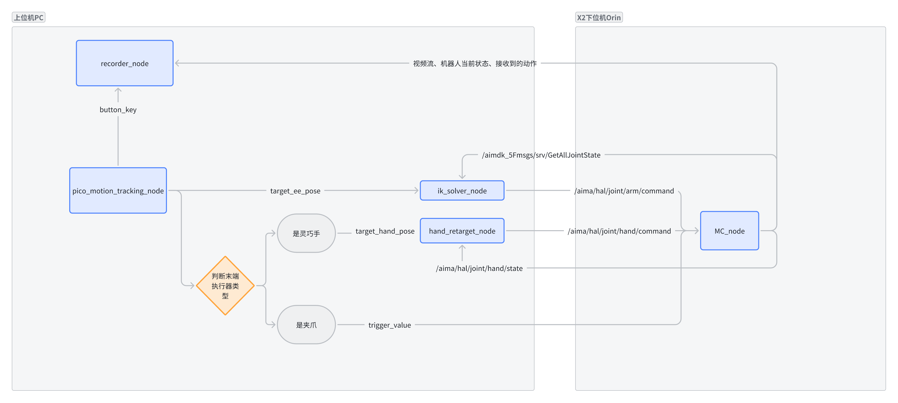
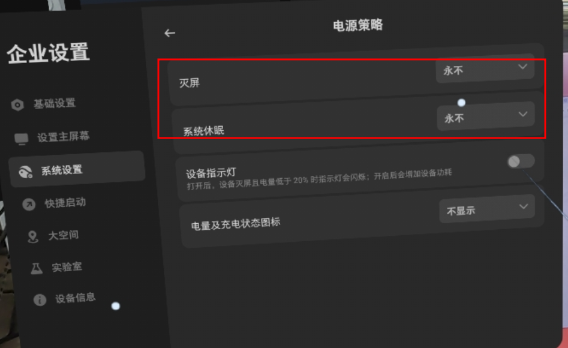
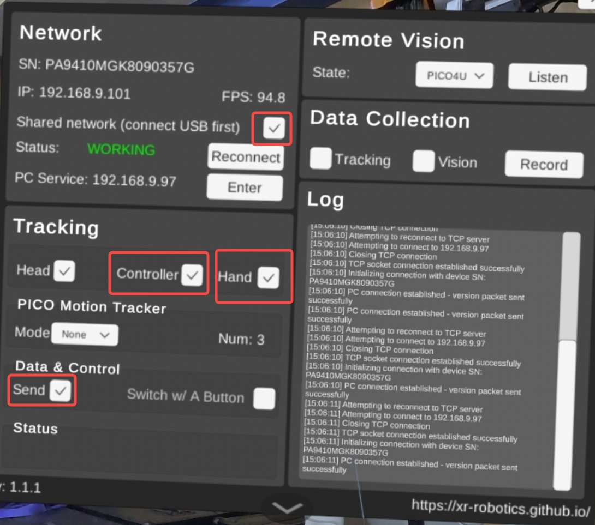
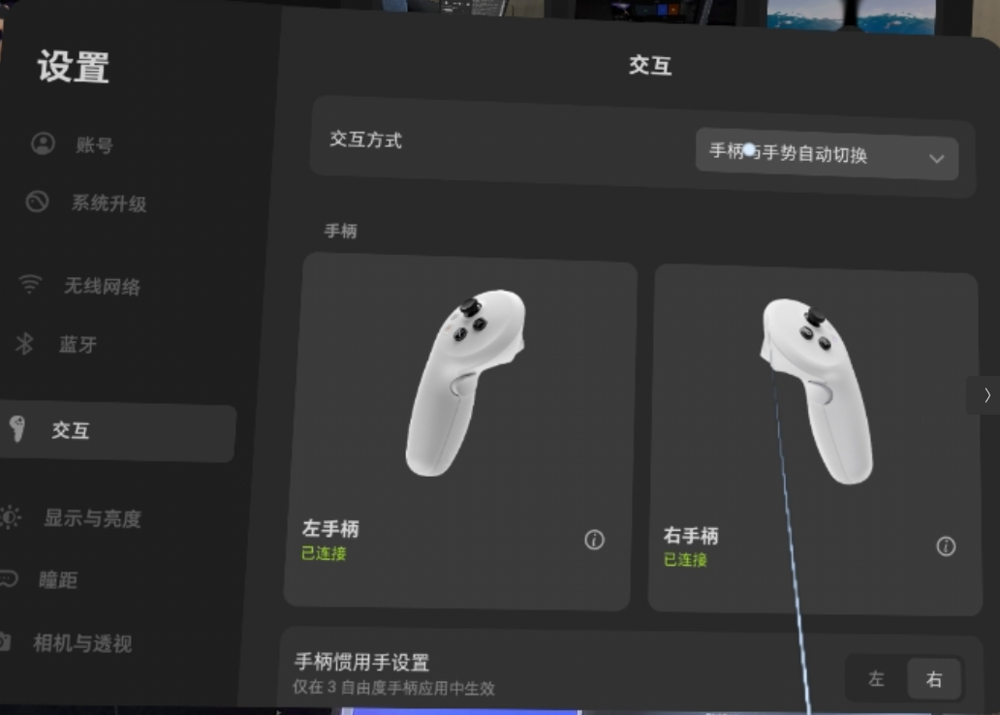

# X2 Teleopration
这个仓库是海信基于[XRoboToolkit-Teleop-Sample-Python](https://github.com/XR-Robotics/XRoboToolkit-Teleop-Sample-Python)开发的，使用PICO VR遥操作智元X2机器人。
conda install pinocchio=3.1.0 --no-deps \
  -c https://mirrors.tuna.tsinghua.edu.cn/anaconda/cloud/conda-forge/ \
  --override-channels
目前实现的功能有：
1. 使用手柄遥操作双臂和夹爪。
2. 使用自己的双手遥操作双臂和灵巧手。
3. 数据（三路图像和关节角状态和指令）录制和保存。
export LD_LIBRARY_PATH=/home/ysm/miniforge3/envs/tv_g1d/lib:$LD_LIBRARY_PATH
待实现的功能有：
- 通过PICO体感追踪器同步人手肘和机器人手肘的位姿
- 实现下半身平衡的全身遥操作

## 环境安装
1. 按照原仓库的安装方式安装依赖。
2. 系统需有ros2-humble环境。
3. 系统需有X2 ROS2 SDK的运行环境。
4. 安装lerobot库（用来转换数据集）
```
# 在已有环境中：
conda install ffmpeg -c conda-forge
# 要使用dataset v2.1对应的lerobot，不要dataset v3.0的!
pip install lerobot==0.3.3 -i https://mirrors.tuna.tsinghua.edu.cn/pypi/web/simple/
```

## 系统流程图


## 遥操使用方式s

### 1. PC端
打开应用程序[XRoboToolkit PC Service](https://github.com/XR-Robotics/XRoboToolkit-PC-Service)  ！！！！！

PC端要和PICO端处在同一个无线局域网（PICO Ultra4 企业版可以用USB有线连接，更稳定；普通版只能无线连接,）。

PC端要和机器人Orin处在同一个有线局域网下。

确保PC电脑已关闭防火墙`sudo ufw disable`
### 2. PICO端
PICO端需要[开启开发者模式](https://developer.picoxr.com/zh/document/unreal/test-and-build/)，同时需要把【开发者选项-企业设置-系统设置】中的【灭屏 和 系统休眠】都改为永不，防止遥操过程中系统休眠。


打开应用程序[XRoboToolkit-PICO-1.1.1.apk](https://github.com/XR-Robotics/XRoboToolkit-Unity-Client/releases/download/v1.1.1/XRoboToolkit-PICO-1.1.1.apk)，跟PC端建立连接后，根据需求勾选发送手柄、灵巧手、体感追踪器的选项。



### 3. 仿真遥操测试
手柄遥操的使用方法详见下方原仓库的`Teleoperation Guide`。
```
mamba activate x2_teleop # 激活本仓库的环境
# 使用手臂遥操作网页仿真中的双臂和夹爪
# 确保pico apk 勾选了 “controller” 选项和"send"选项，才能获得手柄的位姿
python scripts/simulation/teleop_agibot_x2_placco.py
```
使用自己的左手遥操作网页仿真中的灵巧手
使用前确保[设置-交互方式]不是仅手柄，否则无法获得手部的位姿。

```
# 使用前需要把优化求解config放在dex_retarging包的路径下
cp assets/agibot/omnihand/retargeting_config/agibot_omnihand_left.yml $(python -c "import dex_retargeting; print(dex_retargeting.__path__[0])")/configs/teleop/

# 然后修改/home/ysm/miniforge3/envs/x2_teleop/lib/python3.10/site-packages/dex_retargeting/constants.py
class RobotName(enum.Enum):
#    allegro = enum.auto()
#    shadow = enum.auto()
#    svh = enum.auto()
#    leap = enum.auto()
#    ability = enum.auto()
#    inspire = enum.auto()
#    panda = enum.auto()
#    omnihand = enum.auto() # 新增加这一行

ROBOT_NAME_MAP = {
#     RobotName.allegro: "allegro_hand",
#     RobotName.shadow: "shadow_hand",
#     RobotName.svh: "schunk_svh_hand",
#     RobotName.leap: "leap_hand",
#     RobotName.ability: "ability_hand",
#     RobotName.inspire: "inspire_hand",
#     RobotName.panda: "panda_gripper",
#     RobotName.omnihand: "agibot_omnihand", # 新增加这一行
# }

# 然后运行仿真遥操左手
# 确保pico apk 勾选了 “hand” 选项和"send"选项，才能获得手的位姿
python scripts/simulation/teleop_agibot_omnihand_placo.py
```
### 4. 实机遥操
```
    
    注： 运行实机遥操前，请确保已运行过仿真遥操测试，熟悉对应的操作。
    注意：如果机器人更换了网络，需要将image_client_g1.py中将630行改为对应的ip
    查看orin端程序：
  夹爪节点  /home/unitree/unitree_eai_environment/service/dex1_1_service/bin 目录下
  (tv) unitree@ubuntu:~$ ps aux | grep dex
  unitree     2825 10.7  0.0 422448 10200 ?        Ssl  09:56   3:56 /home/unitree/unitree_eai_environment/service/dex1_1_service/bin/dex1_1_gripper_server --network wlan0
  如果出现的参数是--network wlan0 则说明已经是无限模式
  否则需要查看/home/unitree/unitree_eai_environment/service/dex1_1_service/main.cpp
  unitree::robot::ChannelFactory::Instance()->Init(1, vm["network"].as<std::string>()); demain_id 1对应的是wlan 0 对应的是eth0
  停止dex server:
  sudo systemctl stop dex1_gripper.service
  重新启动： dex1_1_gripper_server --network wlan0

  测试夹爪：
  在orin上运行：
  cd /home/unitree/unitree_eai_environment/service/dex1_1_service/bin && sudo ./test_dex1_1_gripper_server --network wlan0 -l -r


  智元夹爪：目前已经实现开机自启动，如有异常，查看 ps aux | grep omni
  出现：/home/unitree/unitree_eai_environment/service/omnipicker/build/example_dds --interface wlan0
  说明启动成功
  否则杀死服务手动重启
  杀死：sudo systemctl stop omni_gripper.service  重启：sudo systemctl restart omni_gripper.service 
  手动启动：
  cd ~/unitree_eai_environment/service/omnipicker/build &&  ./example_dds --interface wlan0

  !!!!!!!!!!!!!!!!!!!!!!!!!!!!!!!!!!!!!!!!!!!!!!!!!!!!!!!!!!! 正常情况下，只需要在orin上执行以下命令
  如果出现控制夹爪失败，则执行：
  sudo chmod 777 -R /dev/ttyUSB*
  /home/unitree/unitree_eai_environment/service/omnipicker/build/example_dds --interface wlan0

  python /home/unitree/unitree_sdk2_python/example/g1/transform_node_chassis.py
  !!!!!!!!!!!!!!!!!!!!!!!!!!!!!!!!!!!!!!!!!!!!!!!!!!!!!!!!!!!
  夹爪测试：
  /home/unitree/unitree_eai_environment/service/omnipicker/build/example_dds_client --gripper 1 --demo
```
```
  查看image_server 一般不用改
  ps aux | grep image
  root        1107 67.1  1.2 2302484 196964 ?      Ssl  09:56  28:28 /home/unitree/miniconda3/envs/tv/bin/python3.10 /home/unitree/miniconda3/envs/tv/bin/teleimager-server

  查看 tranform_node: 位于/home/unitree/unitree_sdk2_python/example/g1节点下
  unitree    22358  101  0.2 1230308 36132 pts/2   Sl+  10:40   1:15 python transform_node.py
  启动transform_node，目前暂时没有设置自动启动，需要手动启动:
  cd /home/unitree/unitree_sdk2_python/example/g1 &&  python transform_node_chassis.py 

  机器人Orin切换网络（推荐网线直连情况下切换）：
  第一种方法：
   ssh连接上机器人之后，执行 bash no_machine.sh
   打开笔记本端nomachnie.sh，修改对应的ip（最好是直连ip）
   在图形界面直接切换网络

   第二种方法：如遇到问题，请咨询ai
    查看wifi是否使能：sudo nmcli radio wifi
    查看wifi列表：sudo nmcli device wifi list
    连接wifi：sudo nmcli device wifi connect <ssid> password <password>
```
```
本地启动：
image_client.py
teleop_G1D_hardware.py

机器人速度调整：
teleop_G1D_hardware.py 中154行
ctrl_chassis[0] = 0.7* round(right_joystick_y) # lift 控制升降速度
ctrl_chassis[1] = 0.3* round(left_joystick_y) # v_x  控制前进后退速度
ctrl_chassis[3] = -0.5* round(left_joystick_x) # v_yaw 控制转弯速度
## Overview（原仓库）

This project provides a framework for controlling robots in robot hardware and MuJoCo simulation through XR (VR/AR) input devices. It allows users to manipulate robot arms using natural hand movements captured through XR controllers.

## Installation
1. Download and install [XRoboToolkit PC Service](https://github.com/XR-Robotics/XRoboToolkit-PC-Service). Run the installed program before running the following demo.

2.  **Clone the repository:**
    ```bash
    git clone https://github.com/XR-Robotics/XRoboToolkit-Teleop-Sample-Python.git
    cd XRoboToolkit-Teleop-Sample-Python
    ```

3.  **Installation**
    **Note:** The setup scripts are currently only tested on Ubuntu 22.04.
    It is recommended to setup a Conda environment and install the project using the included script.
    ```bash
    bash setup_conda.sh --conda <optional_env_name>
    conda activate <env_name>
    bash setup_conda.sh --install
    ```

    If installing on system python:
    ```bash
    bash setup.sh
    ```

## Usage
Use the following instructions to run example scripts. For a more detailed description, please refer to [`teleop_details.md`](teleop_details.md).

### Running the MuJoCo Simulation Demo

To run the teleoperation demo with a UR5e robot in MuJoCo simulation:

```bash
python scripts/simulation/teleop_dual_ur5e_mujoco.py
```
This script initializes the [`MujocoTeleopController`](xrobotoolkit_teleop/simulation/mujoco_teleop_controller.py) with the UR5e model and starts the teleoperation loop.

### Running the Placo Visualization Demo

To run the teleoperation demo with a UR5e robot in Placo visualization:

```bash
python scripts/simulation/teleop_x7s_placo.py
```
This script initializes the [`PlacoTeleopController`](xrobotoolkit_teleop/simulation/placo_teleop_controller.py) with the X7S robot and starts the teleoperation loop.

### Running Dexterous Hand Teleop Simulation
- Shadow hand simulation in Mujoco
    ```bash
    python scripts/simulation/teleop_shadow_hand_mujoco.py
    ```

- Inspire hand in Placo Visualization
    ```bash
    scripts/simulation/teleop_inspire_hand_placo.py
    ```

### Running the Hardware Demo (Dual UR5 Arms and Dynamixel-based Head)

To run the teleoperation demo with the physical dual UR arms and Dynamixel-based head:

1.  **Normal Operation:**
    ```bash
    python scripts/hardware/teleop_dual_ur5e_hardware.py
    ```
    This script initializes the [`DynamixelHeadController`](xrobotoolkit_teleop/hardware/dynamixel.py) and [`DualArmURController`](xrobotoolkit_teleop/hardware/ur.py) and starts the teleoperation loops for both head tracking and arm control.

2.  **Resetting Arm Positions:**
    If you need to reset the UR arms to their initial/home positions and initialize the robotiq grippers, you can run the script with the `--reset` flag:
    ```bash
    python scripts/hardware/teleop_dual_ur5e_hardware.py --reset
    ```
    This will execute the reset procedure defined in the [`DualArmURController`](xrobotoolkit_teleop/hardware/ur.py) and then exit.

3.  **Visualizing IK results:**
    To visualize the inverse kinematics solution with placo during teleoperation, run the script with the `--visualize_placo` flag.
    ```bash
    python scripts/hardware/teleop_dual_ur5e_hardware.py --visualize_placo
    ```

### Running ARX R5 Hardware Demo

To run the teleoperation demo with dual ARX R5 robotic arms:

```bash
python scripts/hardware/teleop_dual_arx_r5_hardware.py
```

This script initializes the [`ARXR5TeleopController`](xrobotoolkit_teleop/hardware/arx_r5_teleop_controller.py) for dual arm control with built-in grippers.

### Running Galaxea R1 Lite Humanoid Demo

To run the teleoperation demo with the Galaxea R1 Lite humanoid robot:

```bash
python scripts/hardware/teleop_r1lite_hardware.py
```

This script initializes the [`GalaxeaR1LiteTeleopController`](xrobotoolkit_teleop/hardware/galaxea_r1_lite_teleop_controller.py) for mobile manipulator control, the controller communicates with the robot hardware via ROS.

## Data Collection

### Collecting Teleoperation Data

The framework automatically logs teleoperation sessions when running hardware demos. Data collection includes:

- **Robot joint states** and end effector poses
- **Camera streams** from multiple viewpoints
- **User input data** from XR controllers
- **Timestamp synchronization** across all data streams

#### Starting Data Collection

1. **Run any hardware teleoperation script:**
   ```bash
   python scripts/hardware/teleop_dual_arx_r5_hardware.py
   ```

2. **Press B button** on the VR controller to start/stop logging
   - First press: Start data logging
   - Second press: Stop logging and save data to disk

3. **Emergency stop:** Press right joystick click to discard current session

#### Data Storage

Collected data is saved as `.pkl` files in the `logs/` directory with timestamps:
```
logs/
├── <robot_name>/
│   └── teleop_log_YYYYMMDD_HHMMSS_<session_id>.pkl
└── <another_robot>/
    ├── teleop_log_YYYYMMDD_HHMMSS_<session_id>.pkl
    └── teleop_log_YYYYMMDD_HHMMSS_<session_id>.pkl
```

### Validating Collected Data

Use the provided analysis script to verify data integrity and examine collected datasets:

```bash
python scripts/misc/test_data_log_analysis.py logs/<robot_name>/teleop_log_YYYYMMDD_HHMMSS_1.pkl
```

This script will:
- Display available data fields and their types
- Verify robot states and camera images are properly saved
- Show sample entries and data statistics
- Count total logged entries

### Converting to LeRobot Dataset

For training imitation learning models, convert collected data to [LeRobot](https://github.com/huggingface/lerobot) format using this example conversion script:

**Example:** [ARX Dual Arm Data Converter](https://github.com/zhigenzhao/openpi/blob/dev/finetuning/examples/arx_r5/arx_dual/convert_dual_arm_data_to_lerobot.py)

This conversion enables:
- Standardized dataset format for machine learning
- Integration with LeRobot training pipelines  
- Support for various imitation learning algorithms
- Easy data sharing and reproducibility

## Teleoperation Guide

### Tracking Modes

The teleoperation system supports multiple tracking modes for controlling robot end effectors:

#### 1. Controller Tracking (Default)
- **Description**: Uses VR/AR controller poses to control robot end effectors
- **Use Case**: Primary method for precise manipulation tasks
- **Configuration**: Set `pose_source` to `"left_controller"` or `"right_controller"`
- **Tracking**: Full 6DOF pose (position + orientation) or 3DOF position-only

#### 2. Hand Tracking
- **Description**: Uses hand pose estimation from XR cameras
- **Use Case**: Natural hand gesture control

#### 3. Head Tracking
- **Description**: Uses headset pose for controlling specific robot components
- **Use Case**: Head/neck control for humanoid robots or camera orientation

#### 4. Motion Tracker Tracking
- **Description**: Uses additional motion tracking devices for controlling auxiliary robot links
- **Use Case**: Multi-point control (e.g., elbow position while controlling end effector)
- **Configuration**: Add `motion_tracker` config with device serial and target link
- **Note**: Not recommended for 6DOF arms like UR5e; better suited for redundant arms

### Controller Button Functions

When using VR controllers for teleoperation, the following button mappings apply:

#### **Grip Buttons**
- **Left Grip** (`left_grip`): Activates left arm teleoperation
- **Right Grip** (`right_grip`): Activates right arm teleoperation
- **Function**: Hold to enable arm control, release to deactivate

#### **Trigger Buttons**
- **Left Trigger** (`left_trigger`): Controls left gripper/hand
- **Right Trigger** (`right_trigger`): Controls right gripper/hand
- **Function**: Analog control (0.0 = fully open, 1.0 = fully closed)

#### **System Buttons**
- **A Button**: Reserved for system functions
- **B Button**: Toggle data logging on/off
  - Press once: Start logging
  - Press again: Stop logging and save data

#### **Joysticks/Touchpads**
- **Left Joystick**: Linear velocity commands for mobile robots
- **Right Joystick**: Angular velocity commands for mobile robots
- **Right Axis Click**: stop data logging (discards current data)


## Dependencies
XR Robotics dependencies:
- [`xrobotookit_sdk`](https://github.com/XR-Robotics/XRoboToolkit-PC-Service-Pybind): Python binding for XRoboToolkit PC Service SDK, MIT License

Robotics Simulation and Solver
- [`mujoco`](https://github.com/google-deepmind/mujoco): robotics simulation, Apache 2.0 License
- [`placo`](https://github.com/rhoban/placo): inverse kinematics, MIT License

Hardware Control
- [`dynamixel_sdk`](https://github.com/ROBOTIS-GIT/DynamixelSDK.git): Dynamixel control functions, Apache-2.0 License
- [`ur_rtde`](https://gitlab.com/sdurobotics/ur_rtde): interface for controlling and receiving data from a UR robot, MIT License
- [`ARX R5 SDK`](https://github.com/zhigenzhao/R5/tree/dev/python_pkg): Interface for controlling ARX R5 robotic arms

## License
This project is licensed under the MIT License - see the [LICENSE](LICENSE) file for details.
